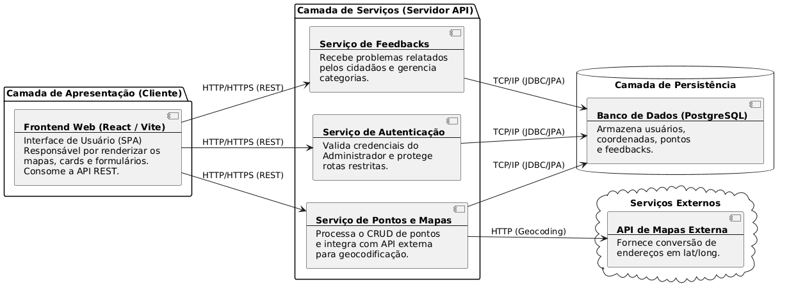

# **Documento de Arquitetura de Software \- V1**

**Sistema de Descarte de Lixo Eletrônico Lavras**

## **1\. Visão Arquitetural**

O sistema adota o modelo arquitetural padrão **Cliente-Servidor (Client-Server)** estruturado através de uma comunicação puramente **RESTful**. A premissa central é o desacoplamento total entre a aplicação de interface com o usuário (Frontend) e o motor de regras de negócio e persistência (Backend). Toda a troca de dados entre os dois ecossistemas é realizada de maneira assíncrona por meio do protocolo HTTPS, utilizando o formato JSON (JavaScript Object Notation) como payload padrão para requisições e respostas.  
Dessa forma, o servidor opera em modo *stateless*, não mantendo estado de sessão em memória, o que otimiza a performance e abre margem para escalabilidade horizontal, enquanto o cliente gerencia o estado da interface dinamicamente.

## **2\. Definição de Camadas e Componentes**

### **2.1. Frontend (React / Vite)**

Responsável direta pela renderização visual, usabilidade e captura de eventos do usuário final (Cidadãos e Administradores). Divide-se internamente em:

* **Camada de Visão (Pages/Components):** Componentes modulares reutilizáveis que tratam a exibição das telas (ex: painel administrativo, cards, modais e mapa).  
* **Camada de Roteamento (React Router DOM):** Gerencia os caminhos internos de navegação da aplicação SPA (Single Page Application), controlando o acesso a rotas públicas e bloqueando rotas privadas.  
* **Camada de Serviço (Axios Client):** Instância responsável por centralizar as chamadas HTTP direcionadas à API do backend, abstraindo cabeçalhos e configurações globais.

### **2.2. Backend (Spring Boot)**

O backend encapsula as regras de negócio, restrições e segurança em uma estrutura clássica de três camadas bem delimitadas:

* **Camada de Controle (Controllers):** Expõe os endpoints REST da aplicação. É a porta de entrada das requisições. Suas atribuições envolvem receber os dados trafegados via DTOs (Data Transfer Objects), acionar as validações sintáticas e direcionar a execução para a camada correspondente de negócio.  
* **Camada de Negócio (Services):** Contém o coração da lógica da aplicação. Processa as validações de consistência, lógica de segurança interna e orquestra a execução de transações bancárias. É totalmente desacoplada das tecnologias de transporte (HTTP) e de armazenamento.  
* **Camada de Acesso a Dados (Repositories):** Abstração provida pelo Spring Data JPA para comunicação com a base relacional. Oculta o mapeamento SQL tradicional através de interfaces limpas que operam diretamente com as entidades de domínio.

### **2.3. Camada de Infraestrutura e Persistência (PostgreSQL)**

O armazenamento persistente é delegado ao PostgreSQL, rodando isoladamente em um container Docker para garantir a homogeneidade do ambiente de desenvolvimento. O ciclo de evolução estrutural das tabelas é estritamente controlado pelo Flyway, assegurando migrações incrementais rastreáveis.

## **3\. Justificativa Técnica das Escolhas Arquiteturais**

As decisões tomadas pelo grupo visam sanar os problemas comuns de acoplamento e lentidão no desenvolvimento distribuído:

| Tecnologia / Padrão | Justificativa Técnica Baseada em Princípios   |
| :---- | :---- |
| **Separação Front/Back** | Aplica o princípio de Separation of Concerns (SoC). Permite que os desenvolvedores trabalhem de forma paralela e independente, reduzindo conflitos em Pull Requests e isolando falhas de renderização de erros de servidor. |
| **Spring Boot Ecosystem** | Fornece inversão de controle (IoC) robusta nativa, facilitando a injeção de dependências e acelerando a configuração de segurança complexa através do Spring Security. |
| **React \+ Vite** | O Vite substitui empacotadores legados (como Webpack), garantindo tempos de compilação locais instantâneos via ES Modules nativos, otimizando o fluxo de desenvolvimento do grupo. |
| **Flyway Migrations** | Evita problemas de dessincronização de esquemas de banco de dados entre os membros da equipe. Cada alteração estrutural vira um script versionado no repositório. |

## **4\. Relação com Requisitos e Atributos de Qualidade**

### **4.1. Atendimento aos Requisitos Funcionais**

* **Autenticação do Administrador (US01):** O Spring Security atua como um interceptor interceptando requisições na camada de controle através de filtros. Senhas passam por hashing seguro na camada de negócio antes de atingir a persistência.  
* **Gestão de Pontos de Coleta e Categorias (US02, US05):** O fluxo de criação flui de maneira limpa através de Controllers que validam os dados de entrada, Services que aplicam as restrições e Repositories que realizam a persistência segura no PostgreSQL.  
* **Visualização de Mapas e Cards (US03):** A API REST expõe um endpoint público que retorna a coleção de ecopontos em JSON de forma performática, permitindo que a biblioteca Leaflet no Frontend processe e renderize dinamicamente os pins.

### **4.2. Atributos de Qualidade Atendidos**

* **Segurança:** Centralizada por filtros de segurança robustos no backend que evitam a exposição indesejada de rotas de dados, combinada com o uso estrito de DTOs para impedir o vazamento do modelo físico do banco.  
* **Manutenibilidade:** A clara divisão de responsabilidades em camadas reduz o acoplamento. Alterações nas regras de negócio ou de validação de dados são feitas estritamente dentro da camada de Serviço, sem necessidade de reestruturar a API ou o banco.  
* **Desempenho:** Comunicação assíncrona focada em payloads leves (JSON), acoplada à arquitetura stateless, reduzindo o consumo de hardware do servidor e acelerando a resposta da interface SPA.