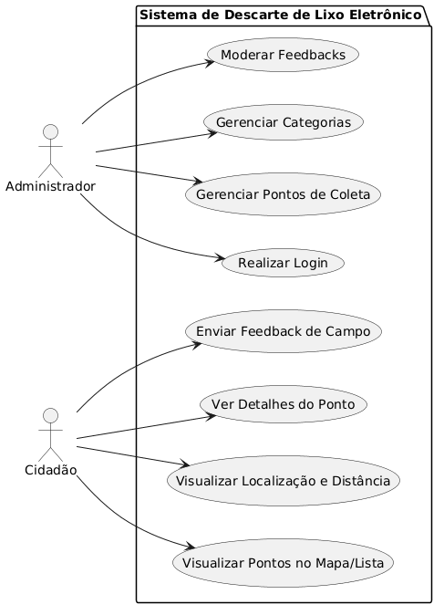
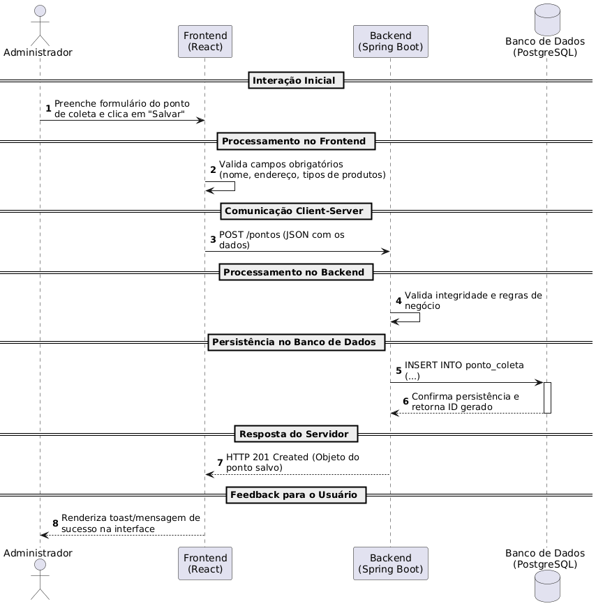

# Modelagem do Sistema - Projeto Descarte de Lixo Eletrônico

## 1. Introdução
Este documento detalha a modelagem do sistema para o projeto de gestão de resíduos eletrônicos, servindo como guia para a compreensão da estrutura, comportamento e interações da aplicação web. O objetivo é assegurar a rastreabilidade entre os requisitos levantados no Product Backlog e a implementação técnica.

## 1.1 Referência de Design
Os protótipos de interface foram desenvolvidos no Figma e servem como base visual para a modelagem das telas do sistema.

Link do Figma: https://www.figma.com/design/CXBHNV7ROR5T0JA5KP8N3Z/Design-Inicial?node-id=0-1&t=8RcZr0mLEG0sYDAX-1

## 2. Diagrama de Casos de Uso
O Diagrama de Casos de Uso representa as interações entre os atores (Administrador e Cidadão) e as funcionalidades principais do sistema, mapeadas diretamente das User Stories (US).

### 2.1 Descrição Textual e Vínculo com Requisitos
* **Administrador**: Atua na gestão e segurança. Seus casos de uso incluem:
    * **Realizar Login**: Garante acesso restrito via autenticação segura (US01).
    * **Gerenciar Pontos de Coleta**: CRUD completo de locais de descarte (US02).
    * **Gerenciar Categorias e Feedbacks**: Moderação de conteúdos e organização de materiais (US05).
* **Cidadão**: Usuário final da plataforma. Seus casos de uso incluem:
    * **Visualizar Pontos (Mapa/Lista)**: Identificação rápida de locais de descarte (US03).
    * **Geolocalização e Distância**: Cálculo de proximidade para facilitar o deslocamento (US04).
    * **Enviar Feedback de Campo**: Relato de problemas em pontos específicos (US06).

---

## 3. Diagrama de Sequência (Cadastro de Pontos)
Este diagrama detalha o "Caminho Feliz" do processo de negócio central: a criação de um novo ponto de coleta pelo Administrador (US02).

### 3.1 Fluxo de Interação
1. **Frontend (React)**: O Administrador preenche o formulário e salva. O cliente valida campos obrigatórios localmente.
2. **Requisição HTTP**: É enviado um `POST /pontos` (JSON) para o servidor.
3. **Backend (Spring Boot)**: O servidor valida as regras de negócio e integra-se com uma API de Mapas para obter latitude e longitude a partir do endereço fornecido.
4. **Persistência**: Os dados são inseridos no **PostgreSQL**. Após confirmação, o servidor retorna o status `201 Created`.
5. **Feedback**: A interface exibe uma mensagem de sucesso ao usuário.

---

## 4. Diagrama de Componentes
O Diagrama de Componentes descreve a organização estrutural da aplicação, evidenciando a separação lógica entre as camadas.

### 4.1 Justificativa de Arquitetura
A arquitetura escolhida visa atender aos requisitos de modularidade e escalabilidade:
* **Frontend (React/Vite)**: Camada de apresentação isolada que consome serviços via API REST.
* **Backend (Spring Boot)**: Organizado em serviços específicos (Autenticação, Pontos e Feedbacks) para garantir alta coesão e baixo acoplamento.
* **Persistência (PostgreSQL)**: Banco de dados relacional centralizado para garantir a integridade dos dados e relacionamentos N:N entre pontos e categorias.
* **Serviços Externos**: Integração com API de Geocodificação para automação das coordenadas cartográficas.

---

## 5. Referências
* Backlog do Produto - Projeto Descarte de Lixo Eletrônico.
* Regulamento do Trabalho Final - Engenharia de Software 2026/1.
