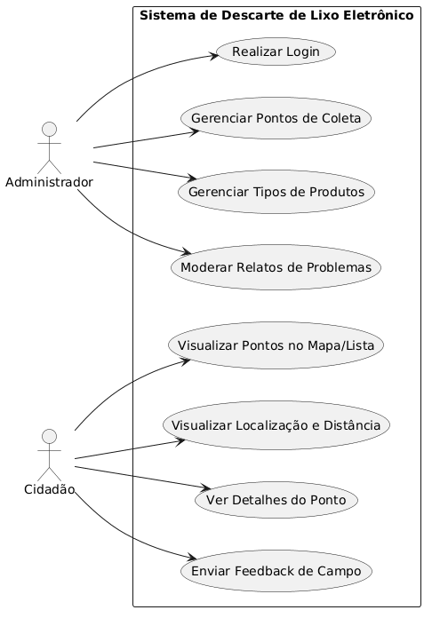
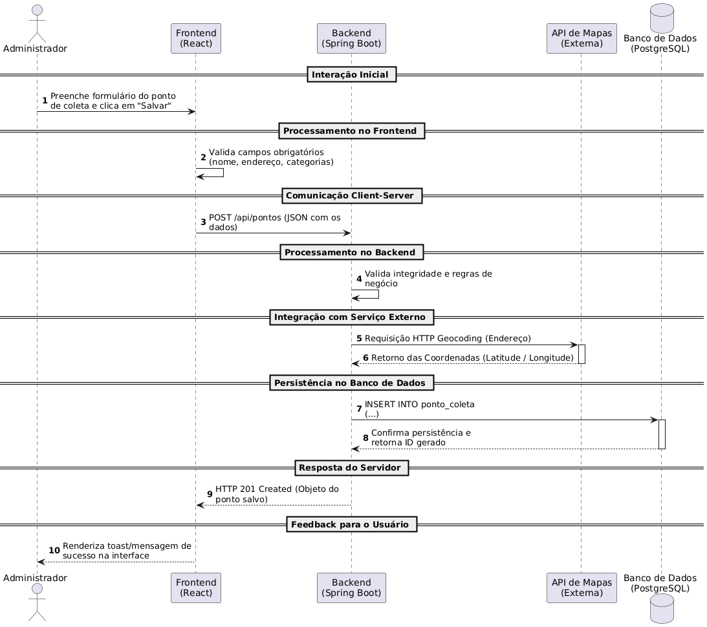
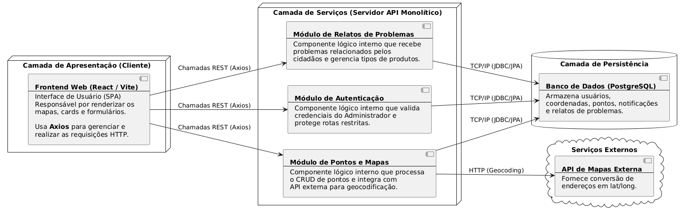
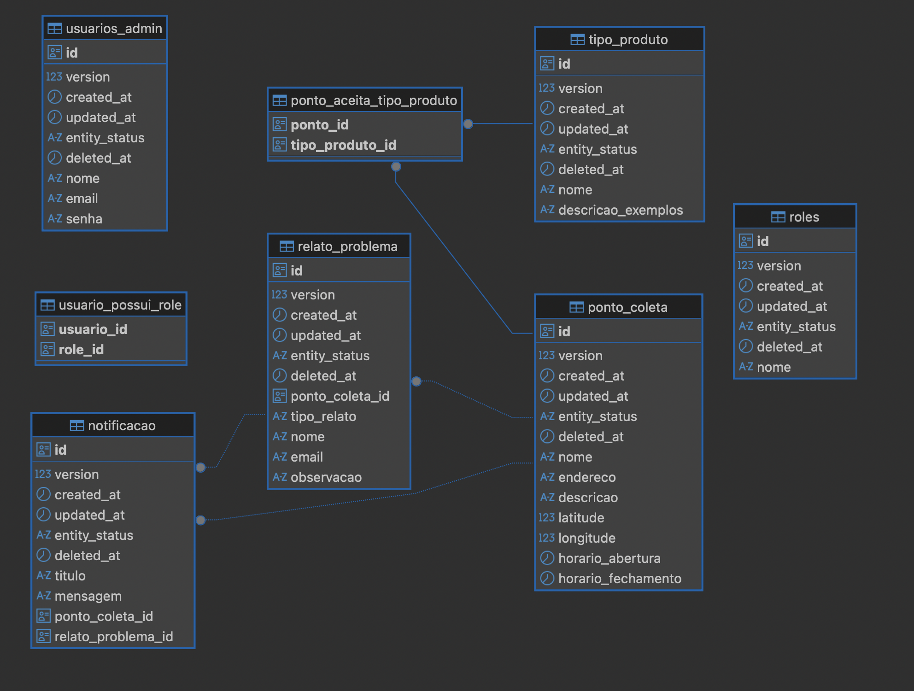

# Modelagem do Sistema - Projeto Descarte de Lixo Eletrônico

## 1. Introdução
Este documento detalha a modelagem do sistema para o projeto de gestão de resíduos eletrônicos, servindo como guia para a compreensão da estrutura, comportamento e interações da aplicação web. O objetivo é assegurar a rastreabilidade entre os requisitos levantados no Product Backlog e a implementação técnica.

## 1.1 Referência de Design
Os protótipos de interface foram desenvolvidos no Figma e servem como base visual para a modelagem das telas do sistema.

Link do Figma: https://www.figma.com/design/CXBHNV7ROR5T0JA5KP8N3Z/Design-Inicial?node-id=0-1&t=8RcZr0mLEG0sYDAX-1

## 1.2 Alinhamento Conceitual (Glossário Técnico)
Para fins de padronização arquitetural e rastreabilidade estrita com o banco de dados relacional, estabelece-se a nomenclatura unificada dos componentes do sistema:
* **Relato de Problema:** Refere-se à entidade de ocorrências enviadas pelos cidadãos (ex: lixeira cheia). Está mapeado na tabela `relato_problema`, no endpoint público de POST e nas suítes de testes como `RelatoProblemaIntegrationTest`.
* **Tipo de Produto:** Refere-se ao catálogo de materiais de lixo eletrônico aceitos (ex: pilhas, baterias, TVs). Está mapeado na tabela `tipo_produto` e gerenciado via painel administrativo.
---

## 2. Diagrama de Casos de Uso
O Diagrama de Casos de Uso representa as interações entre os atores (Administrador e Cidadão) e as funcionalidades principais do sistema, mapeadas diretamente das User Stories (US).

### 2.1 Descrição Textual e Vínculo com Requisitos
* **Administrador**: Atua na gestão e segurança. Seus casos de uso incluem:
    * **Realizar Login**: Garante acesso restrito via autenticação segura (US01).
    * **Gerenciar Pontos de Coleta**: CRUD completo de locais de descarte (US02).
    * **Moderar Relatos de Problemas**: Triagem e alteração de status de ocorrências enviadas pelos cidadãos (US05).
    * **Gerenciar Tipos de Produtos**: Controle do catálogo de materiais de lixo eletrônico aceitos no sistema (US05).
* **Cidadão**: Usuário final da plataforma. Seus casos de uso incluem:
    * **Visualizar Pontos (Mapa/Lista)**: Identificação rápida de locais de descarte (US03).
    * **Geolocalização e Distância**: Cálculo de proximidade para facilitar o deslocamento (US04).
    * **Enviar Feedback de Campo (Relato de Problema)**: Registro e envio de alertas de ocorrências (ex: "Coletor Lotado") em pontos específicos (US06).

---

## 3. Diagrama de Sequência (Cadastro de Pontos)
Este diagrama detalha o "Caminho Feliz" do processo de negócio central: a criação de um novo ponto de coleta pelo Administrador (US02).

### 3.1 Fluxo de Interação
1. **Frontend (React)**: O Administrador preenche o formulário e salva. O cliente valida campos obrigatórios localmente.
2. **Requisição HTTP**: É enviado um POST /api/pontos (JSON) para o servidor, respeitando o padrão dos endpoints da API.
3. **Backend (Spring Boot)**: O servidor valida as regras de negócio e integra-se com uma API de Mapas para obter latitude e longitude a partir do endereço fornecido.
4. **Persistência**: Os dados são inseridos no **PostgreSQL**. Após confirmação, o servidor retorna o status `201 Created`.
5. **Feedback**: A interface exibe uma mensagem de sucesso ao usuário.

---

## 4. Diagrama de Componentes
O Diagrama de Componentes descreve a organização estrutural da aplicação, evidenciando a separação lógica entre as camadas.

### 4.1 Justificativa de Arquitetura
A arquitetura escolhida visa atender aos requisitos de modularidade e escalabilidade:
* **Frontend (React/Vite)**: Camada de apresentação isolada que consome serviços via API REST.
* **Backend (Spring Boot)**: Backend (Spring Boot): Desenvolvido sob a estratégia de Monolito Modular, sendo organizado internamente em sub-módulos e pacotes lógicos específicos (Autenticação, Pontos e Relatos) compartilhando a mesma infraestrutura de runtime para garantir alta coesão, baixo acoplamento e simplicidade de deploy.
* **Persistência (PostgreSQL)**: Banco de dados relacional centralizado para garantir a integridade dos dados e relacionamentos N:N entre pontos e categorias.
* **Serviços Externos**: Integração com API de Geocodificação para automação das coordenadas cartográficas.

---

## 5. Modelagem de Dados (DER)
O Modelo Entidade-Relacionamento define como as informações serão estruturadas no PostgreSQL para suportar as funcionalidades do sistema.

## 5.1 Descrição das Tabelas e Relacionamentos
* **`usuarios_admin`**: Suporta a autenticação segura (US01) através do armazenamento de credenciais com hashes de senha.
* **`ponto_coleta`**: Tabela central que armazena endereços, horários e geolocalização para visualização pública (US02, US03, US04).
* **`tipo_produto`**: Catálogo de materiais permitidos gerido via administração (US05).
* **`ponto_aceita_tipo_produto`**: Tabela associativa que resolve a relação muitos-para-muitos (N:N) entre pontos de coleta e tipos de produtos aceitos.
* **`relato_problema`**: Armazena as ocorrências de campo enviadas pelos cidadãos (US06), permitindo a triagem, moderação e alteração de status pelo administrador no dashboard (US05).
* **`notificacao`**: Registra os alertas internos gerados automaticamente no sistema sempre que um novo relato de problema é inserido (RF10).

---

## 6. Referências
* Backlog do Produto - Projeto Descarte de Lixo Eletrônico.
* Regulamento do Trabalho Final - Engenharia de Software 2026/1.
