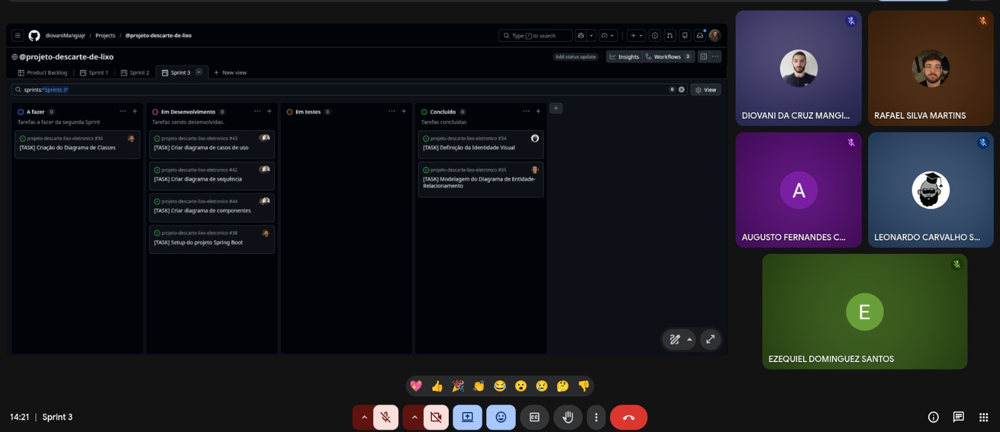
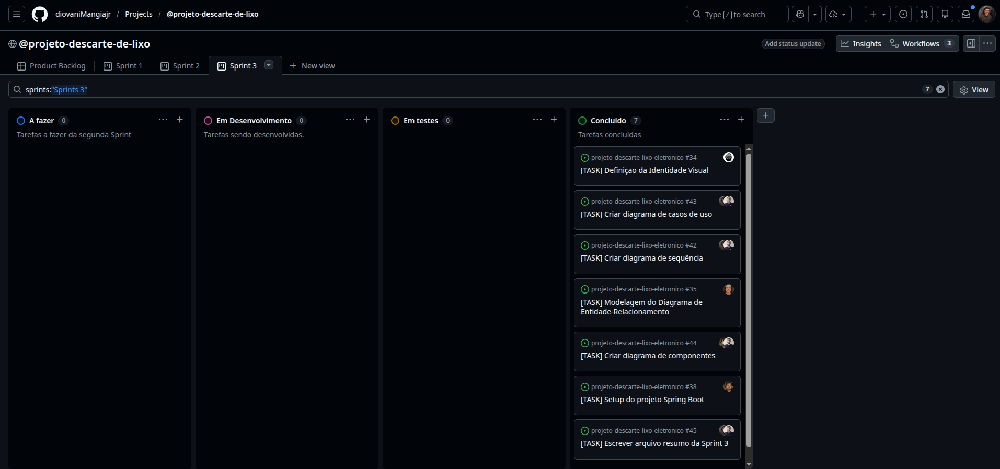

# Sprint 3 - Modelagem do Sistema

## 1. Identificação da Sprint
* **Número da Sprint:** 3
* **Período:** 25/04/2026 a 02/05/2026
* **Data de Entrega:** 02/05/2026

---

## 2. Objetivo da Sprint
O objetivo principal desta sprint foi desenvolver a representação estrutural e comportamental da nossa aplicação web de gestão de descarte de lixo eletrônico. Focamos em criar os diagramas UML e de banco de dados, bem como os protótipos de alta fidelidade, para apoiar as decisões arquiteturais e guiar a implementação técnica.

---

## 3. Itens do Sprint Backlog
As seguintes atividades foram priorizadas e realizadas pela equipe:
* Elaboração do Diagrama de Casos de Uso (US01 a US06).
* Elaboração do Diagrama de Sequência detalhando o fluxo de "Adicionar Novo Ponto de Coleta" (US02).
* Criação do Diagrama de Componentes evidenciando a arquitetura Frontend (React) e Backend (Spring Boot).
* Construção do Modelo Entidade-Relacionamento (DER) para o banco de dados PostgreSQL.
* Prototipação de alta fidelidade no Figma abrangendo as visões do Administrador e Cidadão.
* Redação das descrições textuais complementares e vínculo com os requisitos.

---

## 4. Relação com o Conteúdo da Disciplina
Esta entrega materializa os conceitos estudados no módulo de "Modelos" e "Arquitetura de Software" da disciplina. A equipe aplicou na prática a separação de preocupações (arquitetura cliente-servidor) e utilizou as notações da UML (Casos de Uso, Sequência e Componentes) para garantir a coerência entre o que foi planejado no Product Backlog e o que será efetivamente codificado.

---

## 5. Artefatos Produzidos
Toda a documentação técnica, descrições detalhadas e as imagens dos modelos estão consolidadas no arquivo de modelagem técnica do projeto:
* **[Link para o arquivo modelagem.md](/docs/modelagem/modelagem.md)**.

No arquivo acima, é possível consultar as descrições dos seguintes artefatos:
1. Diagrama de Casos de Uso
2. Diagrama de Sequência (US02)
3. Diagrama de Componentes
4. Diagrama de Entidade-Relacionamento (DER)
5. Criação de um repositório para o back-end: 

---

## 6. Evidências no GitHub e Protótipos
* **Tags/Commits de Modelagem:** 
- Augusto Fernandes: 

- Diovani Mangia: 

- Ezequiel Dominguez: 

- Leonardo Carvalho: 

- Rafael Silva Martins: 

* **Protótipos (Figma):** A equipe projetou 16 telas divididas entre a visão pública (Cidadão) e a visão de gestão (Administrador). Os protótipos de alta fidelidade estão documentados no arquivo `modelagem.md` e as imagens encontram-se exportadas no repositório.
* **Reunião pelo Meet:** A equipe se reuniu para avaliar o andamento e conclusão da sprint 3.

---

## 7. Dificuldades e Revisão
* **Desafios:** No início, tivemos dificuldades com a notação correta da UML no Mermaid, o que nos levou a migrar para o **PlantUML** para garantir maior fidelidade e clareza, principalmente nos Diagramas de Casos de Uso e Componentes. Outro ponto de discussão foi o direcionamento correto das setas de dependência no Diagrama de Componentes, resolvido após consulta bibliográfica.
* **Incremento:** A sprint foi considerada um sucesso. Conseguimos modelar todo o "caminho feliz" planejado para o sistema, garantindo rastreabilidade total entre o código (Figma/DER) e os requisitos originais.

---

## 8. Gestão Visual (Quadro Kanban)
Abaixo, a evidência visual do nosso quadro de tarefas (GitHub Projects) atualizado no fechamento desta Sprint:

