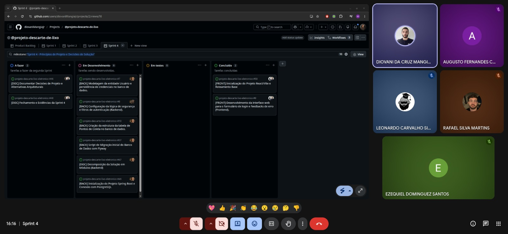
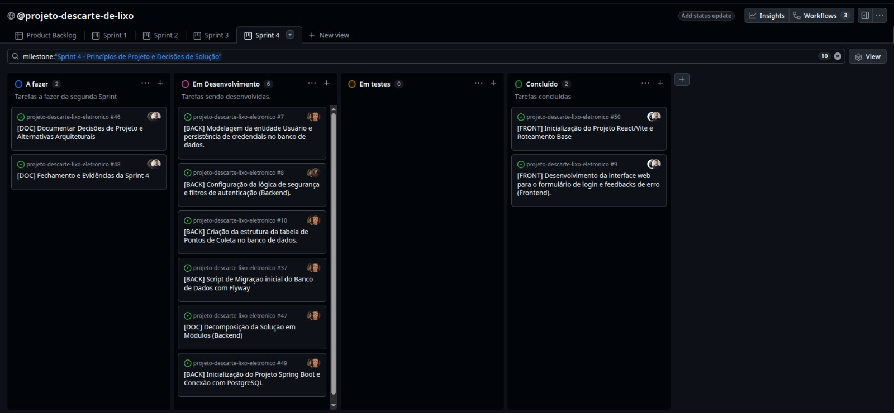

# Sprint 04

## 1. Identificação
- **Número da sprint:** 04
- **Período:** 02/05/2026 a 09/05/2026
- **Data da entrega:** 09/05/2026
- **Equipe:** - Augusto Fernandes Carvalho
  - Diovani da Cruz Mangia Maciel Junior
  - Ezequiel Dominguez Santos
  - Leonardo Carvalho Silva
  - Rafael Silva Martins
- **Product Owner:** Ezequiel
- **Scrum Master:** Diovani

## 2. Objetivo da Sprint
- Estruturar a base arquitetural da aplicação web (Frontend em React/Vite e Backend em Spring Boot/Axios com PostgreSQL via Docker). Iniciar a implementação das funcionalidades de autenticação de administradores (US01) e gestão de pontos de coleta (US02), além de documentar formalmente as decisões de projeto e a decomposição em módulos do sistema.

## 3. Itens do Sprint Backlog
| ID | Descrição | Prioridade | Status |
|---|---|---|---|
| #50 | [FRONT] Inicialização do Projeto React/Vite e Roteamento Base | Alta | Concluído |
| #49 | [BACK] Inicialização do Projeto Spring Boot e Conexão com PostgreSQL local | Alta | Concluído |
| #37 | [BACK] Script de Migração inicial do Banco de Dados com Flyway | Alta | Concluído |
| #9 | [FRONT] Desenvolvimento da interface web para formulário de login (US01) | Alta | Concluído |
| #7 | [BACK] Modelagem da entidade Usuário e persistência de credenciais (US01) | Alta | Concluído |
| #46 | [DOC] Documentar Decisões de Projeto e Alternativas Arquiteturais | Alta | Concluído |
| #47 | [DOC] Decomposição da Solução em Módulos do Backend | Alta | Concluído |
| #48 | [DOC] Fechamento e Evidências da Sprint 4 (Atualização Kanban e Backlog) | Alta | Concluído |

## 4. Relação com o Conteúdo da Disciplina
- Vincula-se ao conteúdo de Princípios de Projeto, demonstrando a aplicação consciente de fundamentos de boa estruturação de software.

## 5. Artefatos Produzidos
- **`docs/projeto/decisoes-de-projeto.md`:** Documento detalhando a escolha da arquitetura (React + Spring Boot), análise de alternativas e a decomposição modular do backend com suas respectivas justificativas técnicas.
- **`docs/sprints/sprint-04.md`:** Relatório de fechamento da sprint contendo evidências de evolução e sincronização do Product Backlog para as próximas etapas.

## 6. Evidências no GitHub
**Arquivos criados/atualizados:**
- `docs/sprints/sprint-04.md`
- `docs/projeto/decisoes-de-projeto.md`

**Commits relevantes:**
- Augusto Fernandes: `https://github.com/rafaelsilvamartins30/backend-eng-soft/pull/2/changes/ae54c0155a4eb810c9466633b38a281c7cb6e250`
- Diovani Mangia: `https://github.com/diovaniMangiajr/projeto-descarte-lixo-eletronico/commit/84c1d21904080874918a1f692d12ab432cd65be7`
- Ezequiel Dominguez: `https://github.com/diovaniMangiajr/projeto-descarte-lixo-eletronico/commit/acda66e64d991b58ff29cdcacb93f1bb7b0d2996`
- Leonardo Carvalho: `https://github.com/diovaniMangiajr/projeto-descarte-lixo-eletronico/commit/c7319e71a65ee8d54d1267d67fc702baaea38679`
- Rafael Silva Martins: `https://github.com/rafaelsilvamartins30/backend-eng-soft/commit/77826e14ac742e99ed05789023ac1e7728908f26`

**Tag da sprint:**
- `Sprint 4 - Princípios de Projeto e Decisões de Solução`

**Registro de Reunião:** 

## 7. Evolução da Aplicação Web
O alicerce da aplicação foi estabelecido nesta etapa. No **Frontend**, o projeto foi inicializado com Vite e React, limpando o boilerplate e configurando o roteamento básico (`react-router-dom`) com a estrutura inicial de pastas e o componente visual de login. No **Backend**, a aplicação Spring Boot foi configurada para se conectar a uma instância local do PostgreSQL (via container Docker no Ubuntu), o versionamento do banco de dados foi iniciado com Flyway e a camada de segurança foi implementada usando Spring Security (configuração de `SecurityFilterChain` e hashing de senhas). As entidades `Usuario` e `PontoColeta` foram mapeadas e refletidas no banco de dados.

## 8. Dificuldades Encontradas
| Dificuldade | Impacto | Ação tomada |
|---|---|---|
| Equipe com conciliação entre trabalho e estudos, gerando tempo apertado para a execução de todas as tarefas planejadas para o período. | Médio | Delegação clara de tarefas, especificação de funções para cada membro e comunicação ativa. Houve o alinhamento de que algumas tarefas pendentes passariam para a próxima sprint de forma controlada. |

## 9. Revisão do Incremento
**O que foi concluído:** - `decisoes-de-projeto.md` (/docs/projeto/decisoes-de-projeto.md)
- `sprint-04.md`: Esse arquivo.

**O que ficou pendente:**
| ID | Descrição | Prioridade | Status |
|---|---|---|---|
| #8 | [BACK] Configuração da lógica de segurança, hashing e filtros de autenticação (US01) | Alta | Pendente |
| #10 | [BACK] Criação da estrutura da tabela de Pontos de Coleta no banco de dados (US02) | Alta | Pendente |

## 10. Pendências para a Próxima Sprint
1. Finalizar a configuração da lógica de segurança, hashing e filtros de autenticação (Retomada da Tarefa #8).
2. Concluir a criação da estrutura da tabela de Pontos de Coleta no banco de dados (Retomada da Tarefa #10).
3. Iniciar a análise e aplicação justificada de **Padrões de Projeto** na solução, conforme foco estipulado para a Sprint 5.

## 11. Gestão Visual (Quadro Kanban)
