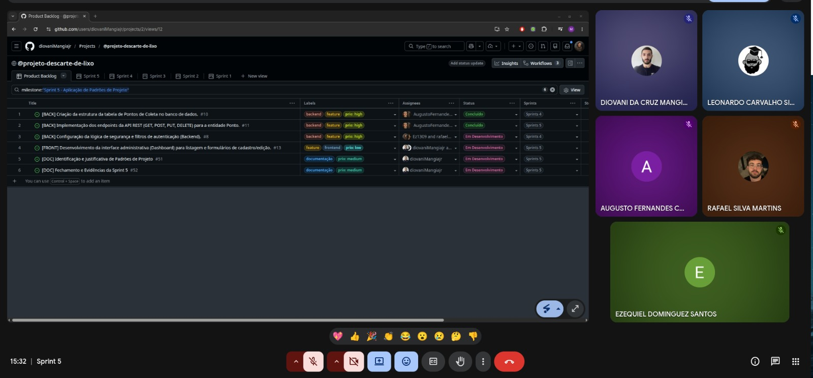
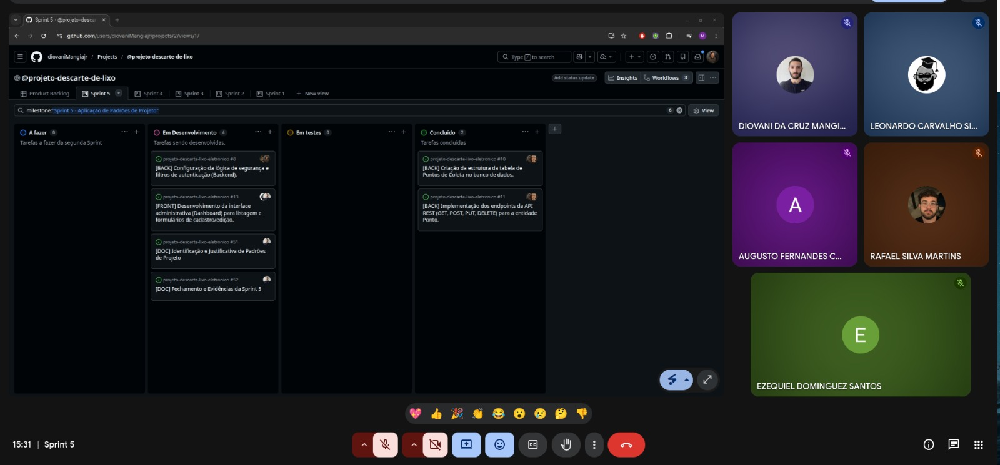

# Relatório de Sprint - Sprint 05

## 1. Identificação
- **Número da sprint:** 05
- **Período:** 09/05/2026 a 16/05/2026
- **Data da entrega:** 16/05/2026
- **Equipe:**
  - Augusto Fernandes Carvalho
  - Diovani da Cruz Mangia Maciel Junior
  - Ezequiel Dominguez Santos
  - Leonardo Carvalho Silva
  - Rafael Silva Martins
- **Product Owner:** Ezequiel Dominguez Santos
- **Scrum Master:** Diovani da Cruz Mangia Maciel Junior

## 2. Objetivo da Sprint
O objetivo principal desta sprint foi identificar e aplicar de forma justificada os **Padrões de Projeto (Design Patterns)** nas camadas de Frontend, Backend e Persistência da aplicação, visando mitigar problemas recorrentes de design e garantir alta coesão e baixo acoplamento. Adicionalmente, o foco esteve em sanar os débitos da sprint anterior e avançar significativamente nas funcionalidades de gerenciamento do sistema (CRUD de Pontos de Coleta e Tipos de Produtos) e na interface pública de visualização.

## 3. Itens do Sprint Backlog

| ID | Descrição | Prioridade | Status |
|---|---|---|---|
| #51 | [DOC] Identificação e Justificativa de Padrões de Projeto | Alta | Concluído |
| #10 | [BACK] Criação da estrutura da tabela de Pontos de Coleta no banco de dados | Alta | Concluído |
| #11 | [BACK] Implementação dos endpoints da API REST (GET, POST, PUT, DELETE) para a entidade Ponto | Alta | Concluído |
| #12 | [BACK] Desenvolvimento das lógicas de controle e validação de persistência do painel administrativo | Alta | Concluído |
| #13 | [FRONT] Desenvolvimento da interface administrativa (Dashboard) para listagem e formulários de cadastro/edição | Alta | Concluído |
| #22 | [TASK] Criação da interface de listagem com cards responsivos | Média | Concluído |
| #27 | [TASK] CRUD de Tipos de Produtos (Entidade, Controller e Interface Admin) | Média | Concluído |
| #29 | [TASK] Ajuste no formulário de pontos para vincular os tipos de produtos existentes (Relacionamento N:N) | Média | Concluído |
| #31 | [TASK] Criação do endpoint público de POST para recebimento de relato de problemas | Baixa | Concluído |

## 4. Relação com o Conteúdo da Disciplina
A Sprint 5 materializa de forma prática o módulo de **Padrões de Projeto**. A equipe demonstram maturidade ao implementar e documentar padrões clássicos do GoF (Criação, Estruturação e Comportamentais) e padrões corporativos (PoEAA). Foram explorados conceitos como *Inversão de Controle (IoC)*, *Injeção de Dependência (DI)*, *Singleton*, *Proxy*, *DTO*, *Chain of Responsibility*, *Repository*, *Data Mapper* e *Unit of Work*, blindando as camadas da aplicação contra vazamento de escopo e interdependência excessiva.

## 5. Artefatos Produzidos
- **`docs/projeto/padroes-de-projeto.md`:** Documentação consolidada contendo a análise profunda e a justificativa técnica de todos os padrões de software adotados no ecossistema do projeto.
- **`docs/sprints/sprint-05.md`:** Este relatório de fechamento e consolidação de entregas da sprint.

## 6. Evidências no GitHub
**Arquivos criados/atualizados:**
- `docs/sprints/sprint-05.md`
- `docs/projeto/padroes-de-projeto.md`

**Commits dos membros:**
- Augusto Fernandes: [Commit-Augusto]
- Diovani Mangia: [Commit-Diovani]
- Ezequiel Dominguez: [Commit-Ezequiel]
- Leonardo Carvalho: [Commit-Leonardo]
- Rafael Silva Martins: [Commit-Rafael]

**Commits e Pull Requests Relacionados:**
- Identificação e Justificativa de Padrões de Projeto (#51)
- Endpoints públicos e privados de controle e mapeamento de dados (Issues #10, #11, #12, #13, #22, #27, #29, #31)

**Tag da sprint:**
- `sprint-05`

**Registro de Reunião:** 

## 7. Evolução da Aplicação Web
O incremento gerado nesta sprint trouxe robustez técnica e funcional ao projeto. No **Backend**, a persistência de dados foi consolidada no PostgreSQL com a criação das tabelas de pontos de coleta e tipos de produtos, gerenciadas por migrações estruturadas. Os endpoints RESTful do CRUD de pontos de coleta e tipos de produtos foram totalmente finalizados e integrados aos padrões de DTO e Service. No **Frontend**, a interface do painel administrativo (Dashboard) avançou com formulários dinâmicos de cadastro e edição capazes de associar tipos de produtos em relacionamentos N:N.

## 8. Dificuldades Encontradas
| Dificuldade | Impacto | Ação tomada |
|---|---|---|
| Tempo escasso devido à rotina mista de trabalho e estudos da graduação dos integrantes. | Médio | Divisão inteligente de tarefas baseada em especialidades (Front/Back/Doc) e comunicação síncrona/assíncrona contínua para evitar gargalos em Pull Requests. |

## 9. Revisão do Incremento
**O que foi concluído:**
- `docs/projeto/padroes-de-projeto.md`
- `docs/sprints/sprint-05.md`
- Telas administrativas de gerenciamento, cards públicos responsivos e APIs de integração sintonizadas com o banco de dados.

**O que ficou pendente:**
- Ajustes finos adicionais na camada de segurança e infraestrutura do Spring Security (#8), que serão refinados e integrados junto às definições arquiteturais de alto nível da próxima etapa.

## 10. Pendências para a Próxima Sprint
1. **Definição da Arquitetura de Software:** Foco central da Sprint 6, detalhando a organização estrutural e os diagramas de alto nível da aplicação.
2. **Refinamento de Segurança:** Concluir ajustes finos pendentes relacionados a filtros de rotas privadas.
3. **Integração com Mapas:** Iniciar a plotagem dinâmica de marcadores e geolocalização na interface pública.

## 11. Gestão Visual (Quadro Kanban)
O acompanhamento visual das tarefas concluídas e a organização do fluxo de trabalho da equipe encontram-se atualizados no GitHub Projects.

<!-- Links do arquivo -->
[Commit-Augusto]: https://github.com/rafaelsilvamartins30/backend-eng-soft/pull/9/changes/ae54c0155a4eb810c9466633b38a281c7cb6e250
[Commit-Diovani]: https://github.com/diovaniMangiajr/projeto-descarte-lixo-eletronico/commit/d07f54dbba7b6a9cc55788757c356ecfe76069a1
[Commit-Ezequiel]: https://github.com/rafaelsilvamartins30/backend-eng-soft/commit/9e09752ef4f200c06404d278037cb6c216d57073
[Commit-Leonardo]: https://github.com/diovaniMangiajr/projeto-descarte-lixo-eletronico/commit/f897ffeb3cc8e2b55607aa161b0e59b21ed4f007
[Commit-Rafael]: https://github.com/rafaelsilvamartins30/backend-eng-soft/commit/8aa416fe953a8cf5f934c8a13bd6b4317fe25e5e