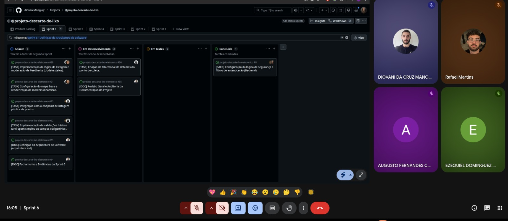
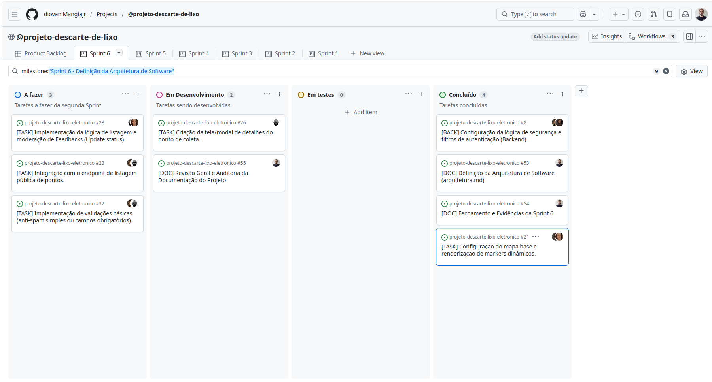

# **Relatório de Sprint \- Sprint 06**

## **1\. Identificação**

* **Número da sprint:** 06  
* **Período:** 16/05/2026 a 23/05/2026  
* **Data da entrega:** 23/05/2026  
* **Equipe:** Augusto Fernandes Carvalho, Diovani da Cruz Mangia Maciel Junior, Ezequiel Dominguez Santos, Leonardo Carvalho Silva, Rafael Silva Martins  
* **Product Owner:** Ezequiel Dominguez Santos  
* **Scrum Master:** Diovani da Cruz Mangia Maciel Junior

## **2\. Objetivo da Sprint**

O objetivo central desta sprint foi estabelecer o alicerce de alto nível e a formalização técnica do projeto por meio da consolidação do documento de **Arquitetura de Software**. No âmbito do desenvolvimento, o foco foi sanar o débito técnico crítico relacionado à segurança do ecossistema, concluindo a implementação de autenticação, hashing de senhas e integração de tokens JWT no backend para proteger os endpoints administrativos da aplicação web.

## **3\. Itens do Sprint Backlog**

| ID / Tarefa | Descrição | Prioridade | Status   |
| :---- | :---- | :---- | :---- |
| \#8 | \[BACK\] Configuração da lógica de segurança, JWT e filtros de autenticação | Alta | **Concluído** |
| \[DOC\] | Definição da Arquitetura de Software (arquitetura.md) | Alta | **Concluído** |
| \[DOC\] | Revisão Geral e Auditoria da Documentação do Projeto (Scrum Master) | Média | **Iniciado / Pendente** |
| \#21 | \[TASK\] Configuração do mapa base e renderização de markers dinâmicos | Média | **Concluído** |
| \#23 | \[TASK\] Integração com o endpoint de listagem pública de pontos | Alta | **Iniciado / Pendente** |
| \#26 | \[TASK\] Criação da tela/modal de detalhes do ponto de coleta | Alta | **Iniciado / Pendente** |
| \#28 | \[TASK\] Implementação da lógica de listagem e moderação de Feedbacks | Baixa | **Iniciado / Pendente** |
| \#32 | \[TASK\] Implementação de validações básicas (anti-spam / campos obrigatórios) | Média | **Iniciado / Pendente** |
| \[DOC\] | Fechamento e Evidências da Sprint 6 (sprint-06.md) | Alta | **Concluído (Este arquivo)** |

## **4\. Relação com o Conteúdo da Disciplina**

Esta entrega vincula-se diretamente ao módulo de **Arquitetura de Software**. A equipe formalizou a divisão estrutural em alto nível no padrão Cliente-Servidor (React/Spring Boot), mapeando fluxos de comunicação RESTful e responsabilidades específicas de cada componente de software. Além disso, o fechamento do card de segurança materializou os conceitos de controle de acesso através de filtros arquiteturais de interceptação (SecurityFilterChain) associados a tokens de autenticação.

## **5\. Artefatos Produzidos**

* **docs/arquitetura/arquitetura.md:** Documentação oficial contendo a especificação das camadas do sistema, diagramas lógicos, justificativas técnicas e atributos de qualidade atendidos.  
* **docs/sprints/sprint-06.md:** Relatório consolidado de acompanhamento e progresso da sprint.

## **6\. Evidências no GitHub**

* **Arquivos criados/atualizados:** docs/sprints/sprint-06.md, docs/arquitetura/arquitetura.md  
* **Tag da sprint:** sprint-06  
* **Registro de Reunião:** 

## **7\. Evolução da Aplicação Web**

No **Backend**, a camada de segurança foi blindada com sucesso. Foi finalizada a integração do Spring Security com autenticação JWT (JSON Web Tokens), incluindo a criação de filtros de interceptação e a lógica estável de criptografia/hashing para armazenamento seguro de credenciais na tabela de usuários. Os cartões de interface pública mapeados para o cidadão (integração de endpoints, mapas e modais) foram devidamente iniciados com suas estruturas base criadas, porém não foram completamente finalizados devido ao afunilamento de capacidade na sprint.

## **8\. Dificuldades Encontradas**

| Dificuldade | Impacto | Ação Tomada (Mitigação)   |
| :---- | :---- | :---- |
| Desencontros de horários na agenda da equipe e ocorrências de motivos de força maior de ordem pessoal entre os integrantes. | Alto | O grupo utilizou a comunicação assíncrona ativa para garantir que as frentes de trabalho fossem iniciadas. Concentrou-se o esforço coletivo no fechamento total da segurança de dados (JWT) e na documentação arquitetural, deixando a consolidação visual do front para a próxima etapa. |

## **9\. Revisão do Incremento**

**O que foi concluído:**

* Documento oficial de arquitetura estruturado e revisado sem inconsistências.  
* Mecanismo de segurança restrita e barreira de autenticação com geração/validação de tokens JWT no Backend.

**O que ficou pendente (Débito Técnico):**

* Configuração visual estável do mapa interativo com marcadores dinâmicos (\#21).  
* Consumo do endpoint de listagem pública de pontos pelo frontend (\#23).  
* Modal de detalhamento expansível de ecopontos selecionados (\#26).  
* Lógicas e telas adicionais de moderação administrativa e validações robustas de formulário (\#28, \#32).

## **10\. Pendências para a Próxima Sprint**

1. Zerar os débitos técnicos de interface do cidadão e mapas pendentes (Issues \#21, \#23 e \#26).  
2. Concluir o fluxo completo das lógicas acessórias de feedback e validações (\#28 e \#32).  
3. Iniciar o planejamento estruturado, mapeamento de cenários e a documentação obrigatória da **Sprint 7: Planejamento e Documentação de Testes**.

## **11\. Gestão Visual (Quadro Kanban)**

O progresso assíncrono das tarefas iniciadas e a organização do fluxo restrito de segurança encontram-se mapeados no GitHub Projects do projeto.  
