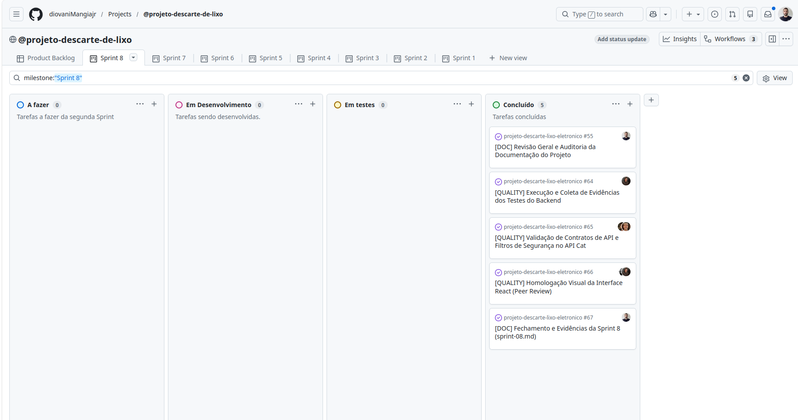

# Relatório de Sprint - Sprint 08

## 1. Identificação

* **Número da sprint:** 08
* **Período:** 30/05/2026 a 03/06/2026
* **Data da entrega:** 03/06/2026
* **Equipe:** Augusto Fernandes Carvalho, Diovani da Cruz Mangia Maciel Junior, Ezequiel Dominguez Santos, Leonardo Carvalho Silva, Rafael Silva Martins
* **Product Owner:** Ezequiel Dominguez Santos
* **Scrum Master:** Diovani da Cruz Mangia Maciel Junior

---

## 2. Objetivo da Sprint

O objetivo central desta sprint final foi a execução prática e consolidação das suítes de testes automatizados (unidade, componente e integração) e da homologação funcional manual da interface por meio de revisão de pares. Adicionalmente, o foco esteve em zerar o último débito técnico de escopo pendente — a tela administrativa de moderação de relatos de problemas (\#28) —, aplicando o estado de *Code Freeze* para a entrega definitiva do MVP.

---

## 3. Itens do Sprint Backlog

| ID / Tarefa | Descrição | Prioridade | Status |
| :--- | :--- | :--- | :--- |
| \#28 | \[TASK\] Implementação da lógica de listagem e moderação de Relatos de Problemas (Retomada) | Alta | **Concluído** |
| \[TEST\] | Execução prática das suítes de testes de unidade (JUnit 5 / Mockito) | Alta | **Concluído** |
| \[TEST\] | Execução de testes de integração conteinerizados (Testcontainers / RestAssured) | Alta | **Concluído** |
| \[TEST\] | Homologação funcional da interface React via checklist de cenários operacionais | Alta | **Concluído** |
| \[DOC\] | Consolidação do Relatório de Evidências de Testes e Validação (evidencias-testes.md) | Alta | **Concluído** |
| \[DOC\] | Fechamento e Evidências da Sprint 8 (sprint-08.md) | Alta | **Concluído (Este arquivo)** |

---

## 4. Relação com o Conteúdo da Disciplina

Esta sprint materializa a aplicação prática avançada dos conceitos de **Validação, Verificação e Testes de Software (VV&T)**. A equipe executou testes caixa-branca dinâmicos na camada de serviços e controladores, testes caixa-preta de integração de APIs para validação de contratos e segurança stateless, e testes de sistema de interface para atestar a conformidade dos critérios de aceitação e regras de negócio do MVP perante os requisitos estipulados.

---

## 5. Artefatos Produzidos

* **docs/testes/evidencias-testes.md:** Documentação oficial consolidando o extrato estatístico de sucesso do Maven, detalhamento das abordagens dinâmicas e o checklist de homologação manual preenchido.
* **docs/sprints/sprint-08.md:** Relatório consolidado de encerramento de ciclo e fechamento da última sprint do projeto.

---

## 6. Evidências no GitHub

* **Arquivos modificados:** docs/sprints/sprint-08.md, docs/testes/evidencias-testes.md, classes de testes automatizados do backend e componentes do dashboard admin.
* **Commits e Build:** Logs de execução e validação anexados ao repositório comprovando o sucesso completo do build via console do Maven.
* **Tag da sprint:** `sprint-08`

---

## 7. Evolução da Aplicação Web

O ciclo de desenvolvimento do MVP foi 100% concluído. No **Backend**, a camada de segurança (JWT) foi integrada às rotas protegidas e a lógica de persistência foi validada com a execução de 162 testes automatizados rodando com zero falhas no console do Maven. A classe `RelatoProblemaIntegrationTest` validou com sucesso o comportamento de gravação relacional. 

No **Frontend**, a issue **\#28** foi totalmente sanada: a interface administrativa do painel de monitoramento (Dashboard) foi finalizada, permitindo que o administrador altere o status de relatos de problemas de "Pendente" para "Resolvido" em tempo real, disparando as notificações lógicas necessárias. O repositório encontra-se estabilizado e em regime de *Code Freeze* para a apresentação final.

---

## 8. Dificuldades Encontradas

| Dificuldade | Impacto | Ação Tomada (Mitigação) |
| :--- | :--- | :--- |
| Configuração da volumetria inicial da base de dados fake nos containers temporários sem quebrar os scripts incrementais de migração do Flyway. | Médio | Isolamento estrito das massas de dados de teste dentro da suíte `RelatoProblemaIntegrationTest` utilizando anotações de transação para expurgar registros ao fim de cada ciclo técnico. |

---

## 9. Revisão do Incremento

**O que foi concluído:**

* Execução prática de 100% das baterias de testes planejadas (unidade, componente e API).
* Eliminação do último débito técnico de escopo do painel administrativo (Issue \#28).
* Homologação manual bem-sucedida de todos os 4 cenários operacionais da interface integrada (React + Spring Boot).
* Elaboração do documento oficial consolidado de evidências de validação.

**O que ficou pendente:**

* Não existem pendências ou débitos técnicos pendentes de código. O software encontra-se finalizado em conformidade com o MVP acordado.

---

## 10. Pendências para as Próximas Etapas (Pós-Projeto)

1. **Preparação de Demonstração:** Organizar o roteiro visual de apresentação e navegação pelas telas para a defesa final perante o professor e colegas de classe.
2. **Auditoria Final de Repositório:** Varredura perene de links e caminhos de arquivos markdown para garantir a integridade total do diretório de documentação de Engenharia de Software.

---

## 11. Gestão Visual (Quadro Kanban)

O fluxo de trabalho foi completamente finalizado no GitHub Projects, movendo todas as tarefas de desenvolvimento, moderação de relatos, testes automatizados e relatórios de evidências para a coluna de concluídos (Done).  
